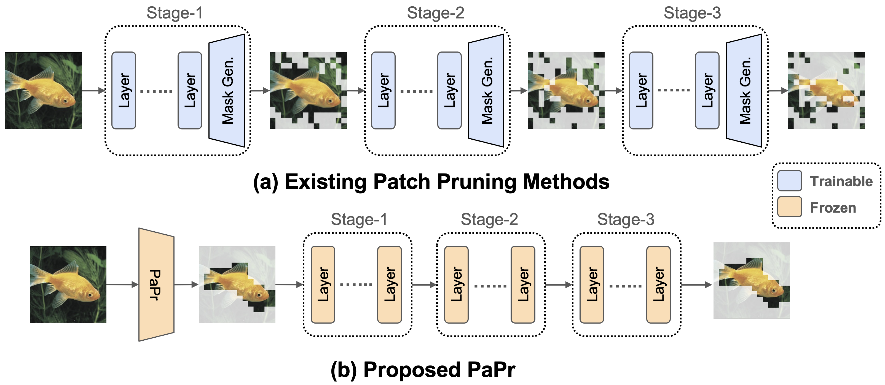

# [PaPr: Training-Free One-Step Patch Pruning with Lightweight ConvNets for Faster Inference (ECCV 2024)](https://arxiv.org/abs/2403.16020) 

[Tanvir Mahmud](https://sites.google.com/view/tanvirmahmud), [Burhaneddin Yaman](https://www.linkedin.com/in/burhan-yaman-12139293/), [Chun-Hao Liu](https://www.linkedin.com/in/chun-hao-liu-b4b6185b/), [Diana Marculescu](https://www.ece.utexas.edu/people/faculty/diana-marculescu) <br>

 We introduce PaPr, a method for substantially pruning redundant patches with minimal accuracy loss using lightweight ConvNets across a variety of deep learning architectures, including ViTs, ConvNets, and hybrid transformers, without any re-training. 

<div align="center">
  
</div>

## Extracting Patch Mask with Pretrained Lightweight ConvNets
PaPr leverages the pretrained lightweight ConvNets to extract precise patch masks with minimal operations. This allows both accurate, fast, and seamless batch operations, and hence, ultra-lightweight ConvNets can drive large off-the-shelf ViTs on most salient patches to speed-up operations, without additional training.

<div align="center">
  
</div>


## Getting Started

We apply PaPr in various architectures in image and video recognition tasks. Please follow the respective folders to setup the data and environment.

### Hierarchical Models

We apply PaPr on various version ConvNext CNN and hierarchical Swin transformers. Please follow the [Hierarchical](./Hierarchical/) folder for more details.

### ViT Models

We apply PaPr on several ViT architectures with various pre-training methods, such as supervised Augreg (see [ViT/AugReg](./ViT/AugReg/)), class-token free ViTs (see [ViT/CTFree](./ViT/CTFree/)), and self-supervised MAEs (see [ViT/MAE](./ViT/MAE/)). Please follow the respective folder for more details.

### VideoMAE Models

We apply PaPr on VideoMAE models in Kinetics400 evaluation. Please follow the [VideoMAE](./VideoMAE/) folder for more details.

## Simple Implementation of PaPr

```python
def apply_papr(x: torch.tensor, f: torch.tensor, z: float) -> torch.tensor:
  """
      x: input ViT tokens of size (batch, N, c)
      f: proposal ConvNet features of size (batch, K, h, w)
      z: keeping ratio for tokens
  """  
  b, n, c = x.shape
  h1 = w1 = numpy.sqrt(n-1) # spatial resolution of tokens
  nt = int(n*z) # total remaining tokens after pruning

  # extract discriminative feature map from proposal features
  Fd = f.mean(dim=1) # size (batch, h, w)
  
  # upsampling F to match patch token spatial resolution in x
  # it generates Patch Significance Map (P)
  import torch.nn.functional as F
  P = F.interpolate(Fd, size=(h1, w1), mode="bicubic") 
  P = P.view(b, -1) # reshaping for pruning mask extraction

  # extracting indices of the most significant patches
  patch_indices = P.argsort(dim=1, descending=True)[:, :nt] 

  patch_indices += 1 # adjusting indices for class tokens

  # preparing class indices for each sample
  class_indices = torch.zeros(b, 1).to(patch_indices.device)

  # Patch mask is obtained combining class and patch indices
  M = torch.cat([class_indices, patch_indices], dim=1)
  
  # extracting tokens based on patch mask
  x = x.gather(dim=1, index=M.unsqueeze(-1).expand(b, -1, c))

  # pruned x tensor size (batch, nt, c)
  return x

```

## PaPr with Existing Patch Reduction Methods

PaPr can be integrated with state-of-the-art patch reduction methods, such as [ToMe](https://arxiv.org/abs/2210.09461). We use the Augreg pretrained ViT-B-16 architecture as the baseline. We sweep token merging ratio (r) for different pruning ratio (z). Integration of PaPr achieves Pareto-optimal performance, thus, PaPr can enhance existing patch reduction methods.

<div align="center">
  
</div>


## Comparsion with CAM methods

PaPr can perform even when the ConvNet proposal confidence (c) is very low. In contrast, existing CAM based methods fail in such cases, despite being significantly slower while not enabling batch processing and use of gradients in some cases. Moreover, PaPr can even enhance the ViT confidence in several challenging scenarios by removing redundant patches.

<div align="center">
  
</div>

## Video Patch Pruning

Video has inherent high sparsity. PaPr effectively localizes the discriminative regions for using holistic spatio-temporal understanding with small ConvNets. Thus, it significantly reduces the computational burden for larger models in downstream video recognition tasks.

<div align="center">
  
</div>


## Acknowledgements

We borrowed codes heavily from [DynamicViT](https://github.com/raoyongming/DynamicViT), [ToMe](https://github.com/facebookresearch/ToMe), and [mmaction2](https://github.com/open-mmlab/mmaction2). We thank them for their amazing work.


## LICENSE
PaPr is licensed under a [UT Austin Research LICENSE](./LICENSE).


## Citation
If you find this work useful, please consider citing our paper:

## BibTeX
```bibtex
@misc{mahmud2024paprtrainingfreeonesteppatch,
      title={PaPr: Training-Free One-Step Patch Pruning with Lightweight ConvNets for Faster Inference}, 
      author={Tanvir Mahmud and Burhaneddin Yaman and Chun-Hao Liu and Diana Marculescu},
      year={2024},
      eprint={2403.16020},
      archivePrefix={arXiv},
      primaryClass={cs.CV},
      url={https://arxiv.org/abs/2403.16020}, 
}
```

## Contributors
<a href="https://github.com/tanvir-utexas/PaPr/graphs/contributors">
  
</a>