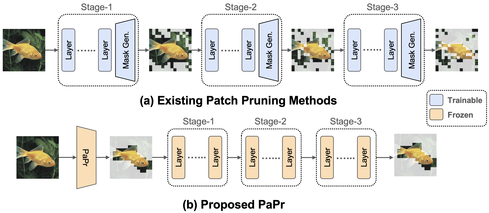

# PaPr: Training-Free One-Step Patch Pruning with Lightweight ConvNets for Faster Inference (ECCV 2024)

[Tanvir Mahmud](https://sites.google.com/view/tanvirmahmud), [Burhaneddin Yaman](https://www.linkedin.com/in/burhan-yaman-12139293/), [Chun-Hao Liu](https://www.linkedin.com/in/chun-hao-liu-b4b6185b/), [Diana Marculescu](https://www.ece.utexas.edu/people/faculty/diana-marculescu) <br>

 We introduce PaPr, a method for substantially pruning redundant patches with minimal accuracy loss using lightweight ConvNets across a variety of deep learning architectures, including ViTs, ConvNets, and hybrid transformers, without any re-training. 

<div align="center">
  
</div>


## Hierarchical Models

We apply PaPr on various version ConvNext CNN and hierarchical Swin transformers. Please follow the [Hierarchical](./Hierarchical/) folder for more details.

## ViT Models

We apply PaPr on several ViT architectures with various pre-training methods, such as supervised Augreg (see [ViT/AugReg](./ViT/AugReg/)), class-token free ViTs (see [ViT/CTFree](./ViT/CTFree/)), and self-supervised MAEs (see [ViT/MAE](./ViT/MAE/)). Please follow the respective folder for more details.

## VideoMAE Models

We apply PaPr on VideoMAE models in Kinetics400 evaluation. Please follow the [VideoMAE](./VideoMAE/) folder for more details.


## PaPr with Existing Patch Reduction Methods

PaPr can be integrated with state-of-the-art patch reduction methods, such as [ToMe](https://arxiv.org/abs/2210.09461). We use the Augreg pretrained ViT-B-16 architecture as the baseline. We sweep token merging ratio (r) for different pruning ratio (z). Integration of PaPr achieves Pareto-optimal performance, thus, PaPr can enhance existing patch reduction methods.

<div align="center">
  
</div>


## Comparsion with CAM methods

PaPr can perform even when the ConvNet proposal confidence (c) is very low. In contrast, existing CAM based methods fail in such cases, despite being significantly slower while not enabling batch processing and use of gradients in some cases. Moreover, PaPr can even enhance the ViT confidence in several challenging scenarios by removing redundant patches.

<div align="center">
  
</div>

## Video Patch Pruning

Video has inherent high sparsity. PaPr effectively localizes the discriminative regions for using holistic spatio-temporal understanding with small ConvNets. Thus, it significantly reduces the computational burden for larger models in downstream video recognition tasks.

<div align="center">
  
</div>


## Acknowledgements

We borrowed codes heavily from [DynamicViT](https://github.com/raoyongming/DynamicViT), [ToMe](https://github.com/facebookresearch/ToMe), and [mmaction2](https://github.com/open-mmlab/mmaction2). We thank them for their amazing work.


## LICENSE
PaPr is licensed under a [UT Austin Research LICENSE](./LICENSE).


## Citation
If you find this work useful, please consider citing our paper:

## BibTeX
```bibtex
@misc{mahmud2024paprtrainingfreeonesteppatch,
      title={PaPr: Training-Free One-Step Patch Pruning with Lightweight ConvNets for Faster Inference}, 
      author={Tanvir Mahmud and Burhaneddin Yaman and Chun-Hao Liu and Diana Marculescu},
      year={2024},
      eprint={2403.16020},
      archivePrefix={arXiv},
      primaryClass={cs.CV},
      url={https://arxiv.org/abs/2403.16020}, 
}
```

## Contributors
<a href="https://github.com/enyac-group/T-VSL/graphs/contributors">
  
</a>